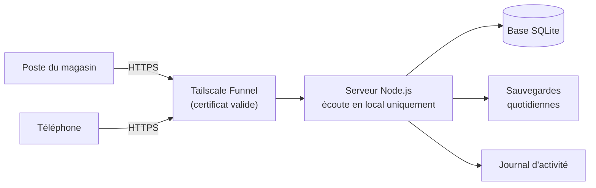

  

  

  <a href="#salut-je-suis-mehdi"><b>Présentation</b></a> &nbsp;·&nbsp;
  <a href="#projet-phare"><b>Projet phare</b></a> &nbsp;·&nbsp;
  <a href="#compétences"><b>Compétences</b></a> &nbsp;·&nbsp;
  <a href="#projets"><b>Projets</b></a> &nbsp;·&nbsp;
  <a href="#outils-réseau-testés"><b>Outils</b></a> &nbsp;·&nbsp;
  <a href="#activité-récente"><b>Activité</b></a> &nbsp;·&nbsp;
  <a href="https://mehdiseg.github.io"><b>Portfolio</b></a>

## Salut, je suis Mehdi

Étudiant en **BTS SIO, option SISR** (Solutions d'Infrastructure, Systèmes et Réseaux). J'aime comprendre comment les choses tournent vraiment : les réseaux, les serveurs, et les petits outils qui les rendent utilisables par tout le monde.

  

## Projet phare

Un **serveur web complet pour un commerce** : catalogue d'articles, comptes avec droits par rôle, import Excel, alertes de réapprovisionnement, étiquettes à codes-barres pour une douchette USB, et un accès sécurisé depuis internet, sans ouvrir aucun port sur la box. Le code est dans un dépôt privé : je le présente sur demande.

<b>Ce que j'y ai mis en pratique</b> (cliquer pour déplier)

 

**Sécurité**
- Mots de passe hachés avec scrypt, sessions par cookie `HttpOnly` et `Secure`, protection CSRF.
- Blocage temporaire après plusieurs échecs de connexion, journal de toutes les actions.
- Droits par rôle : l'employé ne voit pas les prix d'achat, côté serveur et pas seulement à l'écran.
- Création du premier administrateur protégée par un code que seul un accès au PC permet de lire.

**Réseau et systèmes**
- Publication en HTTPS via un tunnel, sans redirection de port : le serveur ne reçoit rien en direct.
- Diagnostic d'un blocage réseau réel : pare-feu Windows, profils réseau public et privé, ports.
- Script d'installation : tâche planifiée de démarrage automatique et veille désactivée (la validation après un redémarrage du PC reste à faire).

**Qualité**
- Dix tests automatiques de bout en bout (connexion, droits, import Excel, sauvegarde, limitation des tentatives).
- Interface pensée d'abord pour le téléphone, testée avec un navigateur piloté par script.
- Sauvegardes automatiques chaque jour avec rotation.

## Compétences

<b>Systèmes et réseaux</b>

 

Commutation Cisco (VLAN, trunks 802.1Q, port-security, Spanning Tree), Linux Debian (nginx, MariaDB, pare-feu UFW, SSH), Windows et PowerShell (scripts, tâches planifiées, pare-feu), HTTPS et certificats, diagnostic de connectivité, tunnels et accès distant.

<b>Outils réseau et sécurité (testés)</b>

 

Analyse de captures avec Wireshark et tshark, audit avec Nmap, VPN WireGuard (génération et validation de configurations), PKI interne avec OpenSSL (certificats avec SAN, connexion TLS vérifiée), plan d'adressage IPv4 et VLSM, Docker Compose. Chaque outil est dans un dépôt avec ses tests : voir la section [Outils réseau testés](#outils-réseau-testés).

<b>Développement web</b>

 

JavaScript, Node.js, Express, SQLite, HTML et CSS (interfaces adaptées au mobile), API REST, import et export de fichiers Excel.

<b>Méthode</b>

 

Git et GitHub, tests automatisés, documentation pas à pas pour des utilisateurs non techniques.

## Projets

| Projet | En bref | Technos |
|---|---|---|
| [**Scanner de réseau PowerShell**](https://github.com/mehdiseg/scanner-reseau-powershell) | Découverte des appareils, ports TCP ouverts, rapport HTML et CSV | PowerShell |
| [**Labs réseau Cisco**](https://github.com/mehdiseg/labs-reseau-cisco) | TP de commutation : VLAN, trunks 802.1Q, port-security, SSH, Spanning Tree | Cisco IOS, Packet Tracer |
| [**Serveur Debian sécurisé**](https://github.com/mehdiseg/serveur-debian-lemp-securise) | Pile nginx, MariaDB, PHP-FPM et pare-feu UFW sur Debian 13 | Debian, nginx, UFW |
| [**Portfolio BTS SIO**](https://github.com/mehdiseg/mehdiseg.github.io) | Mon portfolio pour le BTS SIO SISR | HTML |
| [**Santa's Workshop**](https://github.com/mehdiseg/santas-workshop) | Outil de gestion de production de cadeaux | JavaScript |
| [**TechShop**](https://github.com/mehdiseg/techshop) | Refonte d'un site e-commerce (projet BTS SIO) | HTML |

### Outils réseau testés

Chaque dépôt a des tests automatiques, rejoués à chaque `push` (pastille verte dans le dépôt).

| Dépôt | En bref | Vérifié par |
|---|---|---|
| [**calculateur-sous-reseaux**](https://github.com/mehdiseg/calculateur-sous-reseaux) | Informations d'un réseau, découpage égal et VLSM | 14 tests |
| [**tp-wireshark-analyse-trafic**](https://github.com/mehdiseg/tp-wireshark-analyse-trafic) | Capture synthétique et 18 exercices de filtres Wireshark | chaque réponse vérifiée avec `tshark` |
| [**wireguard-generateur-config**](https://github.com/mehdiseg/wireguard-generateur-config) | Configuration WireGuard serveur et clients | 16 tests avec le vrai `wg` |
| [**pki-interne-openssl**](https://github.com/mehdiseg/pki-interne-openssl) | Autorité de certification interne et certificats avec SAN | 27 vérifications, dont une vraie connexion TLS |
| [**nmap-audit-reseau-local**](https://github.com/mehdiseg/nmap-audit-reseau-local) | Mémo Nmap et comparaison de scans | 16 tests |
| [**homelab-docker-services**](https://github.com/mehdiseg/homelab-docker-services) | Uptime Kuma, Nginx Proxy Manager, Pi-hole | syntaxe validée (pas déployé) |
| [**plex-serveur-multimedia**](https://github.com/mehdiseg/plex-serveur-multimedia) | Guide et Docker Compose pour un serveur Plex | syntaxe validée (guide générique) |
| [**tailscale-funnel-serveur-maison**](https://github.com/mehdiseg/tailscale-funnel-serveur-maison) | Publier une application chez soi en HTTPS, sans redirection de port | état vérifié sur mon PC |

### En préparation

- **14 labs à réaliser** (routage OSPF, NAT et ACL, HSRP, EtherChannel, VPN IPsec, DHCP et DNS, reverse proxy TLS, fail2ban, Suricata, Zabbix, FreeRADIUS, pfSense, Ansible). Les guides sont écrits mais **pas encore rejoués** : chaque dépôt le dit et contient un journal à remplir.
- **11 projets libres forkés** pour m'entraîner (Packet Tracer, netmiko, containerlab, scapy, headscale...). Ce n'est pas mon code.

Tout est classé, avec le statut réel de chaque élément, dans la [**feuille de route réseau**](https://github.com/mehdiseg/roadmap-reseau-bts-sio).

### Outils

  
  
  
  
  
  
  
  
  
  
  
  
  
  
  
  
  

## Activité récente

<!--ACTIVITE:DEBUT-->
- **21 sept.** · [mehdiseg.github.io](https://github.com/mehdiseg/mehdiseg.github.io) : Portfolio BTS SIO SISR - Mehdi Seghier
- **21 sept.** · [roadmap-reseau-bts-sio](https://github.com/mehdiseg/roadmap-reseau-bts-sio) : Feuille de route réseau : ce qui est réalisé, ce qui est testé, ce qui reste à réali…
- **21 sept.** · [tailscale-funnel-serveur-maison](https://github.com/mehdiseg/tailscale-funnel-serveur-maison) : Retour d'expérience : publier en HTTPS une application hébergée chez soi avec Tailsc…
- **21 sept.** · [homelab-docker-services](https://github.com/mehdiseg/homelab-docker-services) : Homelab Docker Compose : Uptime Kuma, Nginx Proxy Manager et Pi-hole, interfaces d'a…
- **21 sept.** · [plex-serveur-multimedia](https://github.com/mehdiseg/plex-serveur-multimedia) : Guide et Docker Compose pour un serveur Plex : organisation des fichiers, sécurité d…
<!--ACTIVITE:FIN-->

Mise à jour automatiquement chaque jour, à partir de mes dépôts publics.

## Mes contributions

  <picture>
    <source media="(prefers-color-scheme: dark)" srcset="https://raw.githubusercontent.com/mehdiseg/mehdiseg/output/snake-dark.svg">
    <source media="(prefers-color-scheme: light)" srcset="https://raw.githubusercontent.com/mehdiseg/mehdiseg/output/snake.svg">
    
  </picture>

---

Toujours en train d'apprendre. Merci de votre visite.

