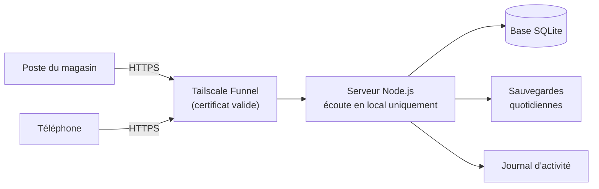

  

  

  <a href="#salut-je-suis-mehdi"><b>Présentation</b></a> &nbsp;·&nbsp;
  <a href="#projet-phare"><b>Projet phare</b></a> &nbsp;·&nbsp;
  <a href="#compétences"><b>Compétences</b></a> &nbsp;·&nbsp;
  <a href="#projets"><b>Projets</b></a> &nbsp;·&nbsp;
  <a href="#activité-récente"><b>Activité</b></a> &nbsp;·&nbsp;
  <a href="https://mehdiseg.github.io"><b>Portfolio</b></a>

## Salut, je suis Mehdi

Étudiant en **BTS SIO, option SISR** (Solutions d'Infrastructure, Systèmes et Réseaux). J'aime comprendre comment les choses tournent vraiment : les réseaux, les serveurs, et les petits outils qui les rendent utilisables par tout le monde.

  

## Projet phare

Un **serveur web complet pour un commerce** : catalogue d'articles, comptes avec droits par rôle, import Excel, alertes de réapprovisionnement, et un accès sécurisé depuis internet, sans ouvrir aucun port sur la box.

<b>Ce que j'y ai mis en pratique</b> (cliquer pour déplier)

 

**Sécurité**
- Mots de passe hachés avec scrypt, sessions par cookie `HttpOnly` et `Secure`, protection CSRF.
- Blocage temporaire après plusieurs échecs de connexion, journal de toutes les actions.
- Droits par rôle : l'employé ne voit pas les prix d'achat, côté serveur et pas seulement à l'écran.
- Création du premier administrateur protégée par un code que seul un accès au PC permet de lire.

**Réseau et systèmes**
- Publication en HTTPS via un tunnel, sans redirection de port : le serveur ne reçoit rien en direct.
- Diagnostic d'un blocage réseau réel : pare-feu Windows, profils réseau public et privé, ports.
- Démarrage automatique avec Windows par tâche planifiée, relance en cas de plantage, veille désactivée.

**Qualité**
- Neuf tests automatiques de bout en bout (connexion, droits, import Excel, sauvegarde, limitation des tentatives).
- Interface pensée d'abord pour le téléphone, testée avec un navigateur piloté par script.
- Sauvegardes automatiques chaque jour avec rotation.

## Compétences

<b>Systèmes et réseaux</b>

 

Commutation Cisco (VLAN, trunks 802.1Q, port-security, Spanning Tree), Linux Debian (nginx, MariaDB, pare-feu UFW, SSH), Windows et PowerShell (scripts, tâches planifiées, pare-feu), HTTPS et certificats, diagnostic de connectivité, tunnels et accès distant.

<b>Développement web</b>

 

JavaScript, Node.js, Express, SQLite, HTML et CSS (interfaces adaptées au mobile), API REST, import et export de fichiers Excel.

<b>Méthode</b>

 

Git et GitHub, tests automatisés, documentation pas à pas pour des utilisateurs non techniques.

## Projets

| Projet | En bref | Technos |
|---|---|---|
| [**Scanner de réseau PowerShell**](https://github.com/mehdiseg/scanner-reseau-powershell) | Découverte des appareils, ports TCP ouverts, rapport HTML et CSV | PowerShell |
| [**Labs réseau Cisco**](https://github.com/mehdiseg/labs-reseau-cisco) | TP de commutation : VLAN, trunks 802.1Q, port-security, SSH, Spanning Tree | Cisco IOS, Packet Tracer |
| [**Serveur Debian sécurisé**](https://github.com/mehdiseg/serveur-debian-lemp-securise) | Pile nginx, MariaDB, PHP-FPM et pare-feu UFW sur Debian 13 | Debian, nginx, UFW |
| [**Portfolio BTS SIO**](https://github.com/mehdiseg/mehdiseg.github.io) | Mon portfolio pour le BTS SIO SISR | HTML |
| [**Santa's Workshop**](https://github.com/mehdiseg/santas-workshop) | Outil de gestion de production de cadeaux | JavaScript |
| [**TechShop**](https://github.com/mehdiseg/techshop) | Refonte d'un site e-commerce (projet BTS SIO) | HTML |

### Outils

  
  
  
  
  
  
  
  
  
  
  
  
  

## Activité récente

<!--ACTIVITE:DEBUT-->
- **8 sept.** · 1 commit dans [mehdiseg.github.io](https://github.com/mehdiseg/mehdiseg.github.io)
<!--ACTIVITE:FIN-->

Mise à jour automatiquement chaque jour, à partir de mon activité publique.

## Mes contributions

  <picture>
    <source media="(prefers-color-scheme: dark)" srcset="https://raw.githubusercontent.com/mehdiseg/mehdiseg/output/snake-dark.svg">
    <source media="(prefers-color-scheme: light)" srcset="https://raw.githubusercontent.com/mehdiseg/mehdiseg/output/snake.svg">
    
  </picture>

---

Toujours en train d'apprendre. Merci de votre visite.

